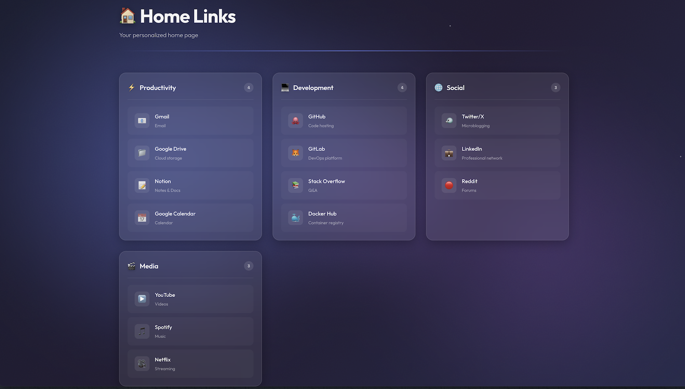

# 🏠 Home Links

An elegant and modern home page to organize your favorite links.




## ✨ Features

- 🎨 **Modern design**: Elegant interface with glassmorphism effects
- 🌈 **Dynamic background**: Animated background with moving colored blobs
- 📱 **Responsive**: Compatible with mobile, tablet, and desktop
- 📁 **Sections**: Organize links by categories
- ⚙️ **Configurable**: Via JSON file (static) or Docker environment variables
- 🐳 **Docker & Kubernetes Ready**

## 🚀 Usage

#### Docker

Available at `http://<your-ip>:3000`

**Docker-compose:**
```bash
# Edit docker-compose.yml, then:
docker-compose up -d
```

**Docker-cli:**
```bash
docker run -d -p 3000:3000 \
  -e HOME_TITLE="My Links" \
  -e HOME_SUBTITLE="Welcome" \
  -e HOME_SECTION_1='{"id":"dev","title":"Dev","icon":"💻","links":[{"name":"GitHub","url":"https://github.com","icon":"🐙"}]}' \
  ghcr.io/cyrilbkr/home-links-pv:latest
```

**Environment variables:**

| Variable | Description | Default |
|----------|-------------|---------|
| `HOME_TITLE` | Page title | Home Links |
| `HOME_SUBTITLE` | Subtitle | Your personalized home page |
| `HOME_FOOTER` | Footer text | © 2026 Home Links |
| `HOME_SECTION_1` | First section (JSON) | - |
| `HOME_SECTION_2` | Second section (JSON) | - |
| `HOME_SECTION_N` | Nth section (JSON) | - |

### Kubernetes 

1. Edit the ConfigMap in `kubernetes.yaml` (title, subtitle, links...)
2. Apply:

```bash
kubectl apply -f kubernetes.yaml
```

### Static

1. Edit `public/config.json` (title, subtitle, links...)
2. Build:

```bash
npm install
npm run build
```

3. Deploy the `dist/` folder to any static hosting (S3, Netlify, Vercel, GitHub Pages...)

### Development

```bash
npm install
npm run dev
```

Available at `http://localhost:5173`

## 🔗 Link Icons

Three options:

**1. Emoji (recommended)**
```json
{"name": "Slack", "url": "https://slack.com", "icon": "💬", "description": "Chat"}
```

**2. No icon** → favicon fetched automatically via Google Favicons
```json
{"name": "Slack", "url": "https://slack.com", "description": "Chat"}
```

**3. Custom image**
```json
{"name": "Slack", "url": "https://slack.com", "favicon": "https://example.com/icon.png", "description": "Chat"}
```

Find emojis at: https://emojipedia.org

## 📝 License

MIT License
